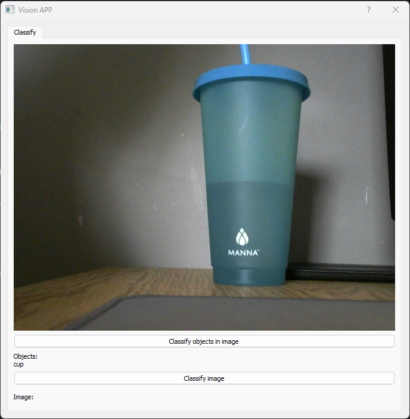

ImageGUI
==============================

This repository contains a PyQT GUI that utilizes a Convolutional Neural Network (CNN) trained on the CIFAR-10 dataset, as well as the You Only Look Once (YOLO) architecture to complete image and object detection/classification. The code is implemented using PyTorch, PyQT5, OpenCV, Python 3, and NumPy.

Example of the GUI can be seen below:



The image classification is still in progress

## Models

The YOLO weights can be found [here](https://pjreddie.com/media/files/yolov3.weights). Download this file and place in the "./models/Yolo" folder

## Setup

To start using the GUI follow the steps below:

- Download the yolo weights from the link above
- Install the python requirements in requirements.txt
- Plug in a webcam
- Run the following in the python environment

```
python main.py
```

## Project Organization


    ├── LICENSE
    ├── Makefile           <- Makefile with commands like `make data` or `make train`
    ├── README.md          <- The top-level README for developers using this project.
    ├── data
    │   ├── external       <- Data from third party sources.
    │   ├── interim        <- Intermediate data that has been transformed.
    │   ├── processed      <- The final, canonical data sets for modeling.
    │   └── raw            <- The original, immutable data dump.
    │
    ├── docs               <- A default Sphinx project; see sphinx-doc.org for details
    │
    ├── models             <- Trained and serialized models, model predictions, or model summaries
    │
    ├── notebooks          <- Jupyter notebooks. Naming convention is a number (for ordering),
    │                         the creator's initials, and a short `-` delimited description, e.g.
    │                         `1.0-jqp-initial-data-exploration`.
    │
    ├── references         <- Data dictionaries, manuals, and all other explanatory materials.
    │
    ├── reports            <- Generated analysis as HTML, PDF, LaTeX, etc.
    │   └── figures        <- Generated graphics and figures to be used in reporting
    │
    ├── requirements.txt   <- The requirements file for reproducing the analysis environment, e.g.
    │                         generated with `pip freeze > requirements.txt`
    │
    ├── setup.py           <- makes project pip installable (pip install -e .) so src can be imported
    ├── src                <- Source code for use in this project.
    │   ├── __init__.py    <- Makes src a Python module
    │   │
    │   ├── data           <- Scripts to download or generate data
    │   │
    │   ├── features       <- Scripts to turn raw data into features for modeling
    │   │    
    │   ├── gui            <- Scripts for running the gui
    │   │
    │   ├── models         <- Scripts to train models and then use trained models to make
    │   │                     predictions
    │   │
    │   └── visualization  <- Scripts to create exploratory and results oriented visualizations
    │
    └── tox.ini            <- tox file with settings for running tox; see tox.readthedocs.io


--------

<p><small>Project based on the <a target="_blank" href="https://drivendata.github.io/cookiecutter-data-science/">cookiecutter data science project template</a>. #cookiecutterdatascience</small></p>
